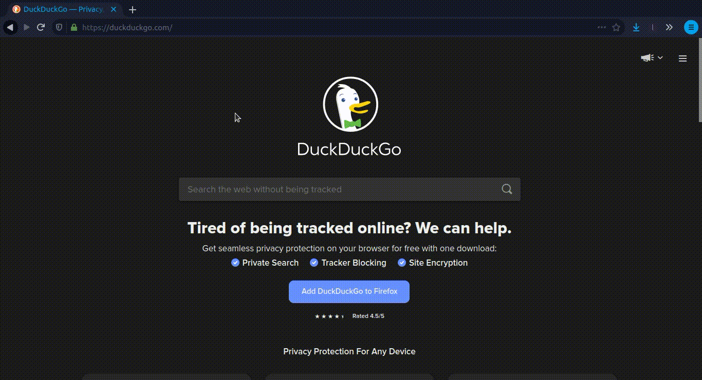
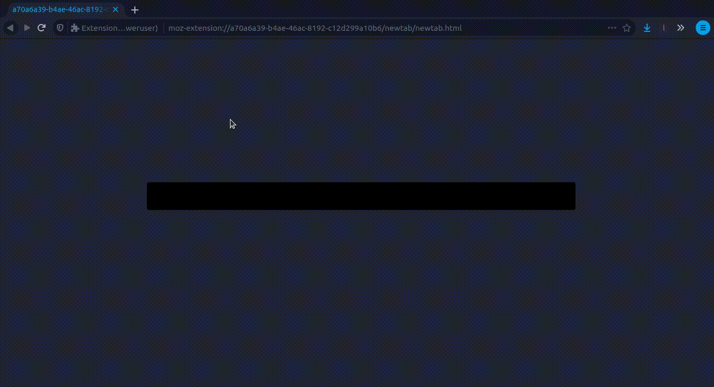

# Newtab for poweruser


*Experience minimalist newtab*
*no need mouse anymore, aliases as bookmark*

 

## Install Extension

|Platform|Link|
|:-:|:-:|
|[](https://addons.mozilla.org/addon/newtab-for-poweruser/)| [Firefox Extension](https://addons.mozilla.org/addon/newtab-for-poweruser/)|

## How to use

1. Press key 't' when no field are focused to open your newtab




2. Type ':settings' & Enter

3. Set up your alias in the configuration area

```
dev https://dev.to
pic https://unsplash.com/s/photos/%s
```


4. Enjoy





## About Newtab for poweruser

Use browser without mouse is now possible. And that's great !

Feel free to open issues or pull requests!

## Privacy

This extension **DO NOT** read or save any of your informations. 

#### dev with <3 by @aloisleclet
